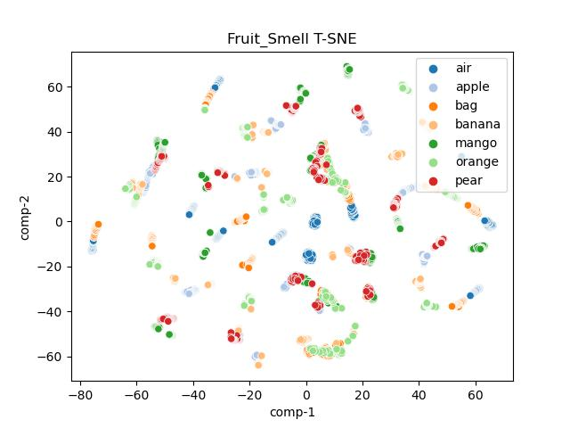
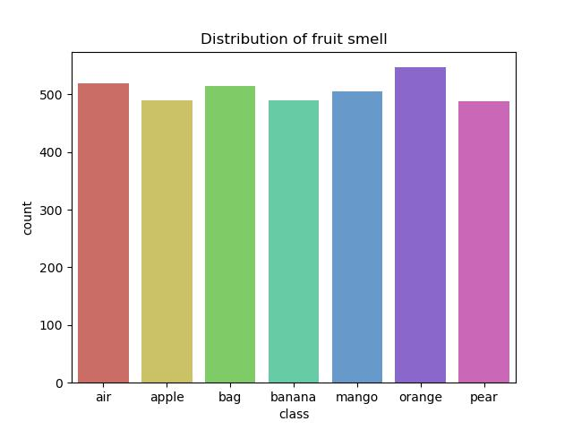

# fruit-smell-analysis
The analysis of the fruit smell dataset collected using the smell inspector device
## Introduction

Electronic nose (e-nose) is a type of sensory technology that mimics the olfactory system of mammals to detect, identify, and quantify smells or volatile organic compounds in the air.

It is a combination of chemical sensors, classifier algorithms, and analysis software that work together to detect and classify different smells. The chemical sensors used in e-noses are able to detect a wide range of gases, such as nitrogen oxides, carbon dioxide, and methane, as well as volatile organic compounds like formaldehyde, benzene, and ethanol.

It can be applied in various areas, such as food and beverage quality control to detect contaminants or spoilage; environmental monitoring to detect pollutants in the air, water or soil; medical diagnosis to detect diseases; and the detection of hazardous chemicals.

This repository provides analysis of fruit smell dataset measurement, visualization, and classifier training and testing for e-nose applications.

## Raw Data
The 'raw' data is obtained by using the [Smell Inspector device with the Smell Annotator software app](https://smart-nanotubes.com/products/#hardware)

The raw measurements from the Smell Annotator are stored in the "raw" directory.

There are 7 different fruit smells, each with multiple samples collected in the office and home using the natural indoor and outdoor conditions during the day and night for packed and unpacked fruit.

## Dataset Parser
The parser combines the raw files, removes unused features, and prepares a dataset for classifier algorithm training.

Meanwhile, timeseries support is added to the dataset.
```
python dataset.py 
```

### Data information visualization
The dataset visualization on a scatter plot using t-distributed stochastic neighbor embedding (t-SNE)
```
python t-SNE.py 
```


```
{
    "0": "air",
    "1": "apple",
    "2": "bag",
    "3": "banana",
    "4": "mango",
    "5": "orange",
    "6": "pear"   
}
```

The dataset detail visualization on a scatter plot
```
python detail.py 
```


The correlation plot of features
```
python corr_ht.py
```


For two most activate features (ch36 and humidity)
```
python feature.py
```

## Classifiers
The classifier algorithms trained  accross 7 classes 45 active features, including humidity and temperature

|              Model                         | f1-score | train_acc | valid_acc |
|:---------------------------------------:|:-----------:|:-----------:|:------------:|
|   Logistic Regression                |    0.27    |    0.30    |     0.29     |
|   KNeighbors                           |     0.93    |    0.97    |     0.93     |
|   Support Vector Machines       |     0.20    |    0.23    |     0.23    |
|   Decision Tree                        |     0.95    |    1.0      |     0.95    |
|   Gaussian NB                         |     0.06    |    0.14    |     0.14    |
|   Random Forest                     |     0.99    |     1.0     |     0.99    |
|   Stochastic Gradient Descent  |     0.29    |    0.29    |     0.31    |
|   Artificial Neural Network         |     0.93    |    0.94    |     0.93    |

## Training
For all features
```
python classifier.py
```

For only ANN
```
python ann.py
```


## Citation
@article{Lawal2023FruitSmell,  
  title={Smell detection of whole fruit in a natural environment using an electronic nose (e-nose)},  
  author={Lawal, Olarewaju M.}, 
  year={2023}
}

## Reference
[innovationcore: smell-datasets](https://github.com/innovationcore/smell-datasets)
